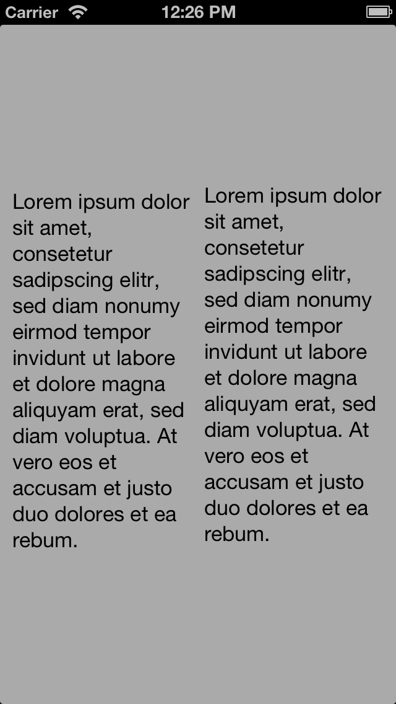

#CJAShowAlignmentRects
See alignment rects of all `UIView` drawn.

##Installation
Just drag & drop the `CJAShowAlignmentRects.h` and `CJAShowAlignmentRects.m` to your project

##Example

 Visible | Hidden
--- | ---
 | 

##Usage
First of all: take a look at the `ExampleViewController.m` in the Example

``` objc
	//Show the Alignment Rects
  [CJAShowAlignmentRects show];

  //Hide the Alignment Rects
  [CJAShowAlignmentRects hide];
  
  //Show or Hide the Alignment Rects with the custom enum flag
  [CJAShowAlignmentRects setStatus: CJAShowAligmentRectsStatusVisible];

  //Get the current status
  CJAShowAligmentRectsStatus status = [CJAShowAlignmentRects status];
```

##LICENSE
Released under the [MIT LICENSE](LICENSE)